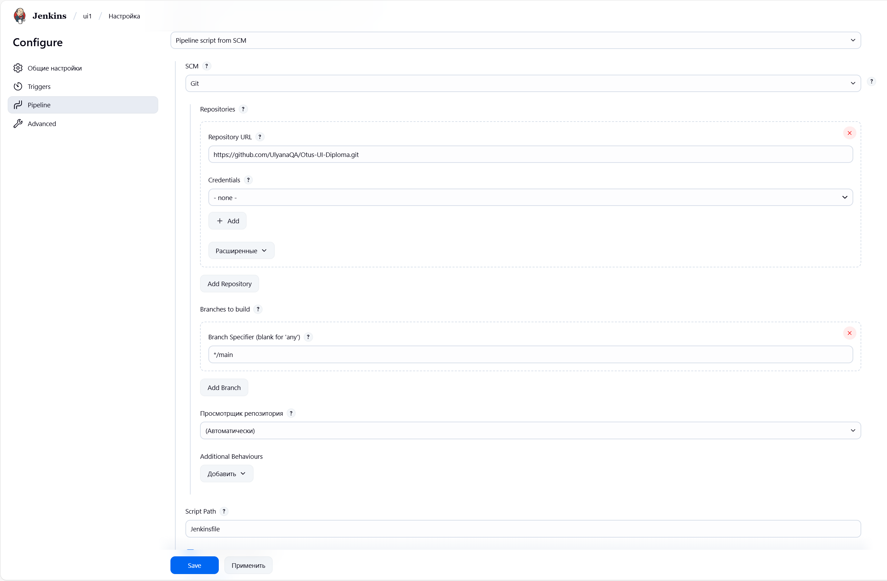
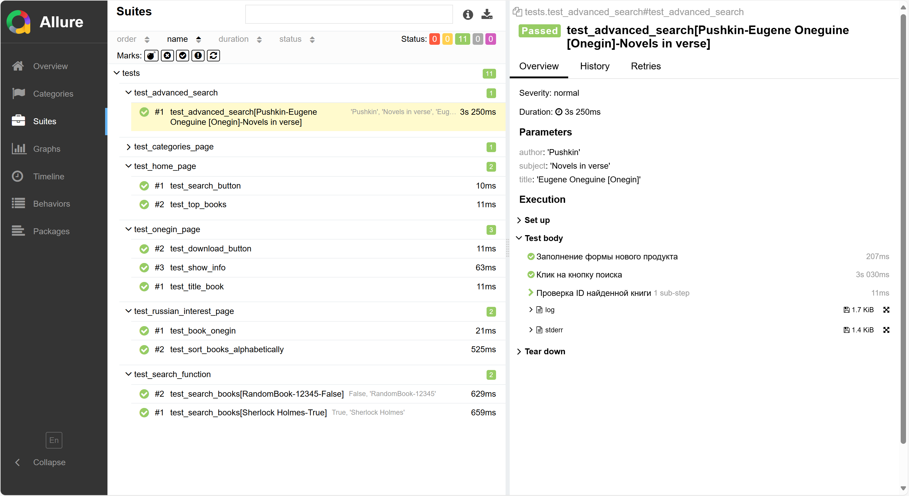

# Otus-UI-Diploma

## Описание проекта

Тесты написаны с использованием pytest и allure для проверки Project Gutenberg (https://www.gutenberg.org/) - электронной библиотеки

### Основные разделы тестов
**test_advanced_search**

1. Проверка расширеренного поиска книги

**test_categories_page**

1. Проверка наличия определенной категории книг

**test_home_page**

1. Проверка наличия поисковой строки
2. Проверка наличия топа последних книг

**test_onegin_page**

1. Проверка наличия названия книги
2. Проверка наличия кнопки сохранения книги 
3. Проверка разворачивания информации о книге

**test_russian_interest_page**

1. Проверка наличия книги
2. Проверка сортировки по алфавиту

**test_search_function**

1. Поиск книги
   - существующей
   - несуществующей

### Запуск тестов
Запуск тестов осуществляется с помощью Jenkinsfile

### Отчетность
Отчеты представлены в виде Allure
